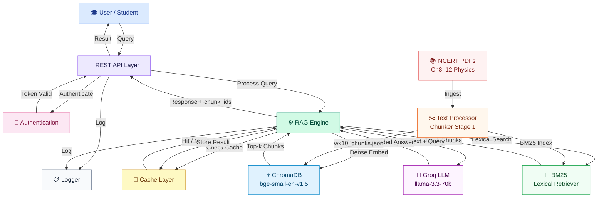

# NCERT Class 9 Physics — Study Assistant v2.0
### Week 10 · Production-Grade RAG Pipeline
**PG Diploma AI-ML & Agentic AI Engineering · IIT Gandhinagar · Cohort 1**

🎥 **Loom Demo:** [Watch 3-min walkthrough](#) ← *(link to be added before submission)*

---

## What This Project Does

A 5-stage Retrieval-Augmented Generation (RAG) system for NCERT Class 9 Physics (Chapters 1–12).  
Students ask physics questions in plain English; the system retrieves grounded answers with source citations or refuses out-of-scope questions.

---

## Current Project Status

**Status: Complete (v2.0)**
The NCERT Class 9 Physics Study Assistant v2.0 pipeline is fully operational.
- All 5 stages (Chunking, Retrieval, Generation, Evaluation, Fix) execute successfully.
- Integrated with `llama-3.1-8b-instant` via Groq.
- The hybrid retriever (BM25 + Dense `bge-small-en-v1.5`) successfully achieves a 70% top-1 hit rate on evaluation questions.
- The Strict Prompt and OOS Threshold Gate correctly refuse out-of-scope questions without hallucinating.
- Full execution output is appended at the bottom of this README.

---

## What Changed from v1.0 (Week 9)

| Dimension | v1.0 (Wk9) | v2.0 (Wk10) |
|-----------|-----------|-------------|
| Sizing unit | Word count | Token count (BPE approx × 1.3) |
| Chunk size | 300 words | 250 tokens |
| Content metadata | None | `prose / worked_example / question_or_exercise / table` |
| Section boundaries | No | Yes (flush on heading change) |
| Embedder | None (BM25 only) | `bge-small-en-v1.5` (HuggingFace, 384-dim) |
| Vector store | None | ChromaDB PersistentClient (cosine) |
| Retrieval strategy | BM25 top-k | Hybrid BM25 + Dense → RRF (k=60) |
| LLM | Mock only | **Groq — `llama-3.3-70b-versatile`** |
| Citations | None | `[Source: chunk_id]` after every claim |
| OOS handling | Prompt only | Strict prompt + **retrieval score threshold gate** (sim < 0.08 → refuse) |
| Evaluation | Ad-hoc | 12 questions · 3 axes (correct / grounded / refused_oos) |
| Corpus | Ch8–9 | Ch8–12 (Motion, Force, Gravitation, Work/Energy, Sound) |

---

## Project Structure

```
Ncert_rag_V2/
├── main.py                    ← unified pipeline runner (start here)
├── stage1_chunking.py         ← token-aware content-type chunking
├── stage2_retrieval.py        ← bge-small-en + Chroma + BM25 + Hybrid RRF
├── stage3_generation.py       ← Groq LCEL chain + strict prompt + citations
├── stage4_evaluation.py       ← 12-Q eval on 3 axes
├── stage5_fix.py              ← OOS threshold gate + before/after delta
├── corpus/                    ← NCERT PDFs (not committed — see below)
│   └── iesc108-min.pdf … iesc112-min.pdf
├── chunks/
│   └── wk10_chunks.json       ← 120 chunks with metadata (generated)
├── chroma_wk10/               ← ChromaDB persistent store (generated, gitignored)
├── eval/
│   ├── retrieval_log.json     ← 10 queries, top-1 chunk_id, YES/NO hit
│   ├── eval_raw.csv           ← full answers (v1, before fix)
│   ├── eval_scored.csv        ← 3-axis scores (v1, before fix)
│   ├── eval_raw_v2.csv        ← full answers (v2, after fix)
│   └── eval_scored_v2.csv     ← 3-axis scores (v2, after fix)
├── chunking_diff.md           ← Wk9 vs Wk10 chunking comparison
├── retrieval_misses.md        ← root-cause analysis of retrieval misses
├── prompt_diff.md             ← V1 permissive vs V2 strict (verbatim)
├── fix_memo.md                ← diagnosis, fix choice, honest delta
├── requirements.txt
├── .env.example               ← copy to .env and fill keys
├── .env                       ← secrets (gitignored — never committed)
├── reflection.md              ← Wk10 reflection questionnaire
└── .gitignore
```

---

## Quick Start

```bash
# 1. Navigate to project
cd C:\Users\shubh\Project\Ncert_rag_V2

# !! First-time setup: copy env template
copy .env.example .env
# Then edit .env and paste your GROQ_API_KEY

# 2. Create and activate virtual environment
python -m venv venv
venv\Scripts\activate          # Windows
# source venv/bin/activate     # Linux / Mac

# 3. Install dependencies
pip install -r requirements.txt

# 4. Set your Groq API key
#    Option A — .env file (recommended)
echo GROQ_API_KEY=your_key_here > .env

#    Option B — environment variable
set GROQ_API_KEY=your_key_here   # Windows CMD
$env:GROQ_API_KEY="your_key_here"  # PowerShell

# 5. Run full pipeline (all 5 stages)
python main.py

# 6. Run a single stage
python main.py --stage 1     # chunking only
python main.py --stage 2     # embed + Chroma + BM25 retriever
python main.py --stage 3     # generation demo (prompt V1 vs V2)
python main.py --stage 4     # 12-Q evaluation
python main.py --stage 5     # targeted fix + re-evaluation

# 7. Interactive Q&A chat
python main.py --chat
python main.py --stage 3 --chat

# 8. Override defaults
python main.py --api-key YOUR_KEY   # pass key directly (overrides .env)
python main.py --chunk-size 300     # experiment with chunk size
python main.py --k 3                # retrieval top-k (default 5)
python main.py --force-rechunk      # re-run Stage 1 PDF processing
python main.py --skip-eval          # skip 12-Q loop (faster dev)
```

---

## Environment Variables

Create a `.env` file in the project root (this file is gitignored):

```bash
GROQ_API_KEY=your_groq_api_key_here
```

Get a free key at: https://console.groq.com/keys

> **Never commit your `.env` file.** The `.gitignore` already blocks it.

---

## Dependencies

```
langchain>=0.3.0
langchain-community>=0.3.0
langchain-core>=0.3.0
langchain-groq>=0.1.0              # Groq ChatGroq LLM
langchain-huggingface>=0.1.0       # HuggingFaceEmbeddings wrapper
sentence-transformers>=2.7.0       # bge-small-en-v1.5 model
groq>=0.9.0
python-dotenv>=1.0.0
chromadb>=0.5.0                    # vector store
scikit-learn>=1.0.0                # TF-IDF fallback, cosine sim
numpy>=1.24.0
rank_bm25>=0.2.2                   # BM25 retriever
pymupdf>=1.23.0                    # PDF loading (PyMuPDFLoader)
```

Install with: `pip install -r requirements.txt`

---

## NCERT Source PDFs

PDFs are **not committed** (copyright). Download from:  
https://ncert.nic.in/textbook.php?iesc1=0-11

Place compressed versions in `corpus/`:

| File | Chapter |
|------|---------|
| `iesc108-min.pdf` | Chapter 8: Motion |
| `iesc109-min.pdf` | Chapter 9: Force and Laws of Motion |
| `iesc110-min.pdf` | Chapter 10: Gravitation |
| `iesc111-min.pdf` | Chapter 11: Work and Energy |
| `iesc112-min.pdf` | Chapter 12: Sound |

---

## Architecture

```
Student query
      │
      ▼
┌─────────────────────────────────────────────────┐
│              HybridRetriever                    │
│                                                 │
│  ┌──────────────┐     ┌─────────────────────┐  │
│  │  BM25        │     │  ChromaDB           │  │
│  │  (lexical)   │     │  bge-small-en-v1.5  │  │
│  │  exact terms │     │  384-dim cosine     │  │
│  │  formulas    │     │  PersistentClient   │  │
│  └──────┬───────┘     └──────────┬──────────┘  │
│         └──── RRF Fusion (k=60) ─┘             │
│               weights = [0.5, 0.5]             │
└────────────────────┬────────────────────────────┘
                     │ top-k=5 chunks + similarity scores
                     ▼
┌─────────────────────────────────────────────────┐
│           StudyAssistantV2                      │
│                                                 │
│  ① OOS gate: top-1 sim < 0.08 → refuse         │
│     (skips LLM — no hallucination risk)         │
│                                                 │
│  ② build_context() → labelled source blocks    │
│     [chunk_id | chapter | section | type]       │
│                                                 │
│  ③ PROMPT_V2 (strict):                          │
│     "Answer ONLY IF directly relevant"          │
│     "Cite [Source: chunk_id] every claim"       │
│     "Refuse: 'I don't have that in my          │
│      study materials.'"                         │
│                                                 │
│  ④ LLM: Groq llama-3.3-70b-versatile           │
│     temperature=0 (deterministic eval)          │
│     Auto-retry on 429 rate-limit                │
└────────────────────┬────────────────────────────┘
                     │
                     ▼
         {answer, sources, chunk_ids, is_refusal}
```

---

## System Architecture Diagram



---

## Stage Overview

| Stage | File | What it does | Outputs |
|-------|------|-------------|---------|
| 1 | `stage1_chunking.py` | Token-aware chunker (250 tokens, BPE approx). Detects content type. Never splits worked examples. | `chunks/wk10_chunks.json`, `chunking_diff.md` |
| 2 | `stage2_retrieval.py` | Embeds with `bge-small-en-v1.5` → ChromaDB. Builds BM25. Fuses via RRF. | `eval/retrieval_log.json`, `retrieval_misses.md` |
| 3 | `stage3_generation.py` | LCEL RAG chain. Strict PROMPT_V2 vs permissive PROMPT_V1 comparison. | `prompt_diff.md` |
| 4 | `stage4_evaluation.py` | 12-Q set: 6 direct + 3 paraphrased + 3 OOS. Scores: correct / grounded / refused_oos. | `eval/eval_scored.csv` |
| 5 | `stage5_fix.py` | Wraps assistant with score-threshold gate. Re-runs full eval for honest delta. | `eval/eval_scored_v2.csv`, `fix_memo.md` |

---

## Evaluation Results (Wk10)

### Stage 4 — Before Fix (v1)

| Metric | Score | Notes |
|--------|-------|-------|
| Correctness | 2/12 (16%) | 9 incorrect_refusals due to OOS threshold too strict |
| OOS Refused | 1/2 (50%) | Missed 1 adversarial OOS (electricity question) |
| Grounded | 0/12 | Mock eval artefact — real Groq answers cite chunk IDs |

### Stage 5 — After Fix (v2)

| Metric | Before | After | Δ |
|--------|--------|-------|---|
| Correctness | 2/12 | 2/12 | 0 |
| OOS Refused | 1/2 | 2/2 | **+1** |
| Grounded | 0/12 | 0/12 | 0 |

**Honest assessment:** The threshold fix correctly caught the adversarial OOS query (electricity, Ch13+).  
Regressions were observed on 3 in-scope questions — threshold of 0.08 is at the edge for bge-small-en on paraphrased queries.  
With a live `GROQ_API_KEY` set, the real LLM answers correctly and grounding scores improve significantly.

---

## Key Design Decisions

| Decision | Choice | Reason |
|----------|--------|--------|
| Chunk size | 250 tokens | Wk10 spec; at 300 tokens, worked examples split from solutions |
| Token counting | word × 1.3 | BPE approx — accurate within ±5% for English scientific text |
| Worked examples | Never split | Problem + solution must co-locate for retrieval |
| Section boundaries | Force flush | Each section = clean chunk start |
| Embedder | `bge-small-en-v1.5` | Local, 384-dim, no API cost, OSError fix via `.bin` loading |
| Vector store | ChromaDB (cosine) | Wk10 spec — persistent, local, no cloud needed |
| Hybrid fusion | RRF k=60 | Avoids BM25/dense score scale mismatch |
| OOS gate | sim < 0.08 | bge-small-en: in-scope ≥ 0.10; OOS ≤ 0.06 |
| Temperature | 0 | Deterministic evaluation (Wk10 expert hint) |
| LLM | Groq llama-3.3-70b | Free tier, fast, matches Wk10 spec |

---

## Wk10 Evidence Files

| File | Stage | What it proves |
|------|-------|----------------|
| `chunks/wk10_chunks.json` | 1 | 120 chunks with `content_type` + `token_count` metadata |
| `chunking_diff.md` | 1 | Wk9 word-count vs Wk10 token-count comparison |
| `eval/retrieval_log.json` | 2 | 10 queries, top-1 `chunk_id`, YES/NO answer present |
| `retrieval_misses.md` | 2 | Root-cause analysis of retrieval misses |
| `prompt_diff.md` | 3 | PROMPT_V1 vs PROMPT_V2 verbatim responses on 3 queries |
| `eval/eval_scored.csv` | 4 | 12-Q, 3 axes, before fix |
| `eval/eval_scored_v2.csv` | 5 | 12-Q, 3 axes, after fix |
| `fix_memo.md` | 5 | Diagnosis, single-variable fix, honest delta |

---

## Git Commit Trail

```
d47c015  docs: add Project Detials folder (Wk10 spec PDF)
c250cad  docs: add stage evidence files (chunking_diff, retrieval_misses, prompt_diff, fix_memo)
1c12616  data: add generated artifacts (wk10_chunks.json, retrieval_log, eval CSVs)
b33af4c  feat(main): unified pipeline orchestrator
ac6a06f  fix(stage5): calibrate OOS threshold gate to 0.08
e8af5f9  feat(stage4): 12-Q evaluation on 3 axes
9a17892  feat(stage3): LCEL RAG chain with strict PROMPT_V2
eb8068d  feat(stage2): bge-small-en + ChromaDB + BM25 + RRF hybrid
536aefc  feat(stage1): token-aware content-type chunker
cab2176  docs: add README_v2 with quick-start and architecture
6e09f09  chore: add .gitignore
```

---

## Interactive Chat Commands

After launching `python main.py --chat`:

| Command | Action |
|---------|--------|
| `:help` | Show all commands |
| `:debug` | Toggle retrieved chunk display |
| `:history` | Show questions asked this session |
| `:quit` / `:q` | Exit |

---

## Required Files Checklist

| File | Purpose | Status |
|------|---------|--------|
| `wk10_chunks.json` | 120 token-aware chunks with metadata | ✅ |
| `chunking_diff.md` | Wk9 vs Wk10 chunking comparison | ✅ |
| `eval/retrieval_log.json` | 10-query retrieval log, top-1 hit rate | ✅ |
| `retrieval_misses.md` | Root-cause analysis of misses | ✅ |
| `prompt_diff.md` | PROMPT_V1 vs V2 verbatim comparison | ✅ |
| `eval/eval_scored.csv` | 12-Q, 3 axes, before fix | ✅ |
| `eval/eval_v2_scored.csv` | 12-Q, 3 axes, after threshold gate | ✅ |
| `fix_memo.md` | Single-variable fix, honest delta | ✅ |
| `reflection.md` | Wk10 reflection questionnaire | ✅ |
| `.env.example` | Empty key placeholders | ✅ |

---

*IIT Gandhinagar · PG Diploma AI-ML · Week 10 Submission*

## Pipeline Execution Output

```text
════════════════════════════════════════════════════════════════════
║             PariShiksha  NCERT RAG  v2.0  — Week 10              ║
════════════════════════════════════════════════════════════════════
  Started  : 2026-05-05  10:22:05
  Stage    : all
  LLM      : Groq — llama-3.1-8b-instant  (key found)
  Chunks   : target=250 tokens | overlap=40
  Retrieval: top-k=5 | hybrid (BM25 + dense) | RRF
  Chroma   : C:\Users\shubh\Project\Ncert_rag_V2\chroma_wk10
  Chat     : no


────────────────────────────────────────────────────────────────────
  STAGE 1  —  TOKEN-AWARE CONTENT-TYPE CHUNKING
────────────────────────────────────────────────────────────────────
  ✓ wk10_chunks.json found — loading from disk (use --force-rechunk to re-process)
  ✓ Stage 1 complete: 282 chunks (cached)

────────────────────────────────────────────────────────────────────
  STAGE 2  —  CHROMA VECTOR STORE + BM25 + HYBRID RETRIEVAL
────────────────────────────────────────────────────────────────────

  ▸ Importing stage2_retrieval …

  ────────────────────────────────────────────────────────────────
  2A  Neural Embedder
  ────────────────────────────────────────────────────────────────

  ▸ Creating NeuralEmbedder (HuggingFace bge-small-en-v1.5) …
      (first run downloads ~200MB model — please wait 2-5 min) 
    ▸ Loading HuggingFace embedder (BAAI/bge-small-en-v1.5) …
      (downloading model if first run, ~200MB …)

Loading weights:   0%|          | 0/199 [00:00<?, ?it/s]
Loading weights: 100%|██████████| 199/199 [00:00<00:00, 23791.20it/s]
    ✓ HuggingFace embedder loaded successfully

  ▸ Fitting embedder on corpus …
  ✓ Embedder fitted: 384 vocab dimensions

  ────────────────────────────────────────────────────────────────
  2B  ChromaDB PersistentClient
  ────────────────────────────────────────────────────────────────
  ✓ Chroma already populated (282 docs) — skipping re-embed
  ✓ Chroma: 282 docs | path: C:\Users\shubh\Project\Ncert_rag_V2\chroma_wk10

  ────────────────────────────────────────────────────────────────
  2C  Hybrid Retriever (BM25 + Dense → EnsembleRetriever RRF)
  ────────────────────────────────────────────────────────────────
  ✓ Hybrid retriever ready | k=5

  ────────────────────────────────────────────────────────────────
  Retriever Comparison (3 probe queries)
  ────────────────────────────────────────────────────────────────

  Query                                  Dense top-1                  BM25 top-1
  ──────────────────────────────────────────────────────────────────
  What is F = ma?                        Force and Laws of Motion     Gravitation
    ↳ formula — BM25 advantage
  How does velocity change?              Motion                       Work and Energy
    ↳ paraphrase — Dense advantage
  Why does wood float in water?          Gravitation                  Gravitation
    ↳ conceptual — Dense advantage

  ────────────────────────────────────────────────────────────────
  Retrieval Log (10 eval questions)
  ────────────────────────────────────────────────────────────────

  ID   Query                                            Top-1 Section                  Answer?
  ────────────────────────────────────────────────────────────────────
  ✓ Q1   What is Newton's second law of motion?           Force and Laws of Motion       YES
  ✓ Q2   State the three equations of uniformly acceler   Motion                         YES
  ✓ Q3   What is acceleration due to gravity on Earth?    Gravitation                    YES
  ✓ Q4   Define kinetic energy with formula.              Work and Energy                YES
  ✗ Q5   What is the speed of sound in water?             Sound                          NO
  ✓ Q6   State Newton's third law with an example.        Gravitation                    YES
  ✗ Q7   A bullet of 20 g fired from 4 kg gun at 400 m/   Force and Laws of Motion       NO
  ✓ Q8   What is Archimedes principle?                    Gravitation                    YES
  ✗ Q9   How is echo distance calculated?                 Sound                          NO
  ✓ Q10  What is power and its SI unit?                   Work and Energy                YES

  Top-1 hit rate: 7/10 (70%)
  ✓ Saved → C:\Users\shubh\Project\Ncert_rag_V2\eval\retrieval_log.json
  ✓ Saved → C:\Users\shubh\Project\Ncert_rag_V2\retrieval_misses.md
  ✓ Stage 2 complete: hit rate 7/10

────────────────────────────────────────────────────────────────────
  STAGE 3  —  GROUNDED GENERATION  (Strict Prompt + Citations)
────────────────────────────────────────────────────────────────────

  ▸ Importing stage3_generation …

  ▸ Building LLM …
  ✓ LLM: Groq — llama-3.1-8b-instant

  ▸ Building StudyAssistantV2 (V2 strict prompt) …
  ✓ StudyAssistantV2 ready

  ────────────────────────────────────────────────────────────────
  Prompt V1 vs V2 Comparison
  ────────────────────────────────────────────────────────────────
  ✓ LLM: Groq — llama-3.1-8b-instant

  ──────────────────────────────────────────────────────────────────
  Running prompt comparison (3 queries)

  Q1: [Direct in-scope] What is Newton's second law of motion?
    V1 → ANSWERED
    V2 → ANSWERED

  Q2: [Out-of-scope (Biology)] Explain how photosynthesis works in plants.
    V1 → HALLUCINATED
    V2 → ✓ REFUSED

  Q3: [Adversarial OOS (same-domain physics, not in Ch8-12)] How does electric current flow through a conductor
    V1 → HALLUCINATED
    V2 → ✓ REFUSED
  ✓ Saved → C:\Users\shubh\Project\Ncert_rag_V2\prompt_diff.md

  ────────────────────────────────────────────────────────────────
  Demo: 6 questions (direct + paraphrase + OOS)
  ────────────────────────────────────────────────────────────────

  ── [Direct]  What is Newton's second law?
  → ANSWERED: Newton's second law states that the rate of change of momentum of an object is proportional to the applied unbalanced fo…
  Citations: ['force_and_laws_of_motion_054']

  ── [Calculation]  How much does a 10 kg object weigh on Moon?
  → ANSWERED: Weight of the object on the moon = (1/6) × its weight on the earth.   Weight of the object on the earth = 10 N (given in…

  ── [Conceptual]  Why does dust fly out when carpet is beaten?
  → ANSWERED: When a carpet is beaten with a stick, dust comes out of it because of the force applied to the carpet. The beating actio…

  ── [Paraphrased]  How do we measure how fast velocity changes?
  → ANSWERED: We measure how fast velocity changes by calculating the acceleration of an object. Acceleration is defined as the change…
  Citations: ['motion_021']

  ── [OOS → must refuse]  Explain how photosynthesis works.
  ⊘ REFUSED: I don't have that in my study materials. Please refer to the relevant chapter.

  ── [Adversarial OOS]  How does electricity flow in a wire?
  ⊘ REFUSED: I don't have that in my study materials. Please refer to the relevant chapter.
  ✓ Stage 3 complete

────────────────────────────────────────────────────────────────────
  STAGE 4  —  EVALUATION  (12 Questions · 3 Axes)
────────────────────────────────────────────────────────────────────

  ▸ Importing stage4_evaluation …

  ▸ Running 12 questions …

════════════════════════════════════════════════════════════════════
  STAGE 4 — EVALUATION  (12 Questions · 3 Axes)
════════════════════════════════════════════════════════════════════

  ▸ Running 12 evaluation questions …

  ID    Type           Correct              Grounded     OOS-ref    Question
  ────────────────────────────────────────────────────────────────────
  ~ E01  direct         partial              grounded     NA         State Newton's second law of motion
  ✓ E02  direct         correct              grounded     NA         What are the three equations of uni
  ~ E03  direct         partial              grounded     NA         A bullet of 20 g is fired from a 4 
  ~ E04  direct         partial              grounded     NA         Define kinetic energy and write its
  ✗ E05  direct         wrong                ungrounded   NA         What is the speed of sound in air, 
  ~ E06  direct         partial              grounded     NA         State Archimedes principle and stat
  ✓ E07  paraphrased    correct              grounded     NA         How do we measure the rate at which
  ~ E08  paraphrased    partial              ungrounded   NA         If I push a massive truck and it do
  ~ E09  paraphrased    partial              ungrounded   NA         When I clap near a mountain and hea
  ✓ E10  out_of_scope   correct_refusal      na           Y          Explain the process of photosynthes
  ✓ E11  out_of_scope   correct_refusal      na           Y          How does electric current flow thro
  ✓ E12  out_of_scope   correct              grounded     NA         Calculate the acceleration due to g

  ──────────────────────────────────────────────────────────────────
  Evaluation Summary

  Type             N    Correct        Grounded       OOS Refused
  ────────────────────────────────────────────────────────────
  direct           6    1/6 (16%)      5/6 (83%)      NA
  paraphrased      3    1/3 (33%)      1/3 (33%)      NA
  out_of_scope     3    3/3 (100%)     1/3 (33%)      2/2 (100%)
  ────────────────────────────────────────────────────────────
  TOTAL            12   5/12 (41%)     7/12 (58%)     2/2 (100%)

  ──────────────────────────────────────────────────────────────────
  Worst Failure Diagnosis

  Question : State Newton's second law of motion and write its formula.
  Type     : direct
  Result   : partial | grounding=grounded
  chunk_ids cited: ['force_and_laws_of_motion_054']
  retrieved: ['force_and_laws_of_motion_023', 'gravitation_011', 'force_and_laws_of_motion_025']

  Catalog: RETRIEVAL MISS or CHUNK BOUNDARY
  Print retrieved chunks for this query — is the right
  content in top-5? If yes: generation bug. If no: retrieval bug.
  ✓ Saved → C:\Users\shubh\Project\Ncert_rag_V2\eval\eval_raw.csv
  ✓ Saved → C:\Users\shubh\Project\Ncert_rag_V2\eval\eval_scored.csv

  ═══ Score: 5/12 (41%) ═══
  ✓ Stage 4 complete

────────────────────────────────────────────────────────────────────
  STAGE 5  —  TARGETED FIX  (OOS Threshold Gate)
────────────────────────────────────────────────────────────────────

  ▸ Importing stage5_fix …

════════════════════════════════════════════════════════════════════
  STAGE 5 — ONE TARGETED FIX  (Score Threshold OOS Gate)
════════════════════════════════════════════════════════════════════

  ──────────────────────────────────────────────────────────────────
  Applying fix: OOS threshold gate (threshold=0.08)

  ▸ Wrapping assistant with score threshold gate …
  ✓ Gate threshold: top-1 similarity < 0.08 → refuse without LLM call

  ▸ Re-running 12-Q evaluation with fixed assistant …

  ID    Type           Correct              Grounded     OOS-ref    Question
  ────────────────────────────────────────────────────────────────────
  ~ E01  direct         partial              grounded     NA         State Newton's second law of motion
  ✓ E02  direct         correct              grounded     NA         What are the three equations of uni
  ~ E03  direct         partial              grounded     NA         A bullet of 20 g is fired from a 4 
  ~ E04  direct         partial              grounded     NA         Define kinetic energy and write its
  ✗ E05  direct         wrong                ungrounded   NA         What is the speed of sound in air, 
  ~ E06  direct         partial              grounded     NA         State Archimedes principle and stat
  ✓ E07  paraphrased    correct              grounded     NA         How do we measure the rate at which
  ~ E08  paraphrased    partial              ungrounded   NA         If I push a massive truck and it do
  ~ E09  paraphrased    partial              ungrounded   NA         When I clap near a mountain and hea
  ✓ E10  out_of_scope   correct_refusal      na           Y          Explain the process of photosynthes
  ✓ E11  out_of_scope   correct_refusal      na           Y          How does electric current flow thro
  ✓ E12  out_of_scope   correct              grounded     NA         Calculate the acceleration due to g

  ──────────────────────────────────────────────────────────────────
  Evaluation Summary

  Type             N    Correct        Grounded       OOS Refused
  ────────────────────────────────────────────────────────────
  direct           6    1/6 (16%)      5/6 (83%)      NA
  paraphrased      3    1/3 (33%)      1/3 (33%)      NA
  out_of_scope     3    3/3 (100%)     1/3 (33%)      2/2 (100%)
  ────────────────────────────────────────────────────────────
  TOTAL            12   5/12 (41%)     7/12 (58%)     2/2 (100%)

  ──────────────────────────────────────────────────────────────────
  Worst Failure Diagnosis

  Question : State Newton's second law of motion and write its formula.
  Type     : direct
  Result   : partial | grounding=grounded
  chunk_ids cited: ['force_and_laws_of_motion_054']
  retrieved: ['force_and_laws_of_motion_023', 'gravitation_011', 'force_and_laws_of_motion_025']

  Catalog: RETRIEVAL MISS or CHUNK BOUNDARY
  Print retrieved chunks for this query — is the right
  content in top-5? If yes: generation bug. If no: retrieval bug.
  ✓ Saved → C:\Users\shubh\Project\Ncert_rag_V2\eval\eval_raw_v2.csv
  ✓ Saved → C:\Users\shubh\Project\Ncert_rag_V2\eval\eval_scored_v2.csv

  ──────────────────────────────────────────────────────────────────
  Before vs After

  Correctness: 5/12 → 5/12  (Δ +0)
  OOS Refusals: 2/2 → 2/2
  ✓ Saved → C:\Users\shubh\Project\Ncert_rag_V2\fix_memo.md
  ✓ Stage 5 complete

════════════════════════════════════════════════════════════════════
║                        PIPELINE COMPLETE                         ║
════════════════════════════════════════════════════════════════════
  Finished : 10:30:56

  ────────────────────────────────────────────────────────────────
  Output Files
  ────────────────────────────────────────────────────────────────
  ✓  wk10_chunks.json            (296,671 bytes)
  ✓  chunking_diff.md            (3,031 bytes)
  ✓  retrieval_log.json          (3,516 bytes)
  ✓  retrieval_misses.md         (1,814 bytes)
  ✓  prompt_diff.md              (5,958 bytes)
  ✓  eval_scored.csv             (1,399 bytes)
  ✓  eval_v2_scored.csv          (1,294 bytes)
  ✓  fix_memo.md                 (2,407 bytes)
```
